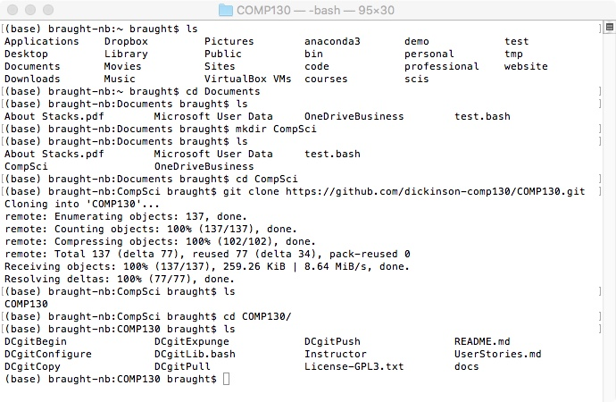
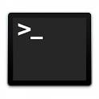

## COMP130 - Introduction to Computing

### Lab 01 - Course Tools and Practices

#### Introduction

This lab introduces you to some of the tools and practices that we will be using throughout the semester.  The first part of that will be to become familiar with the tools that you'll be using to get the lab (and in-class activities and homework) assignments.

You will work though this lab using pair-programming, taking turns in the *Driver* and *Navigator* roles. For now, have one partner log into the computer and that partner being the driver while the other is the navigator.  

We will work though the first steps in this lab together.  You can return to the text below later to help you recall what we have done.

#### The Terminal

Most users today interact with their computers through the Graphical User Interface (e.g. pointing and clicking on menus and buttons). To control more fully and precisely most computer scientists also make use of an interface know as the *terminal* (a.k.a. *command prompt*, *shell*, or *command prompt*).  A terminal looks like Figure 1 below and allows the user to control the computer using text commands.

  
__Figure 1: A terminal__

For now, you will just need to get the terminal open and use a few commands that are given below.  These commands will retrieve the lab assignment from GitHub so that you can begin working on it.  The lab assignment will then introduce and walk you through the other terminal commands that you will need to know this semester.

#### Getting the base COMP130 Course Materials

To get the base materials for the COMP130 course onto a new machine you will use the following steps:

1. Open a terminal by clicking on its icon on the dock a the bottom of the screen.  The icon looks like Figure 2.

    
  __Figure 2: The Terminal Icon__

2. To get the base set of materials for COMP 130 we will use the commands below.  You will type (or copy and paste) each of the `grey highlighted commands` into the terminal in turn, pressing return after each command.  The bullets below each command give you a little information about what each command does.
  - `ls`
    - The `ls` command lists the files in the current directory.  The current directory when you open a terminal will be your *Home Directory*.
  - `cd Documents`
    - The `cd` command changes the current directory to the specified sub-directory (i.e. folder). In this case it changes into the directory named *Documents*. Everyone has a *Documents* folder in their home directory by default.
  - `ls`
  - `mkdir CompSci`
    - The `mkdir` command creates a new directory (i.e. a sub-directory) in the current directory.  In this case it makes a new directory named *CompSci*.
  - `ls`
    - You should now see the CompSci directory listed in the Documents directory.
  - `cd CompSci`
  - `ls`
    - The CompSci directory should be empty.
  - `git clone https://github.com/dickinson-comp130/COMP130.git`
    - The `git clone` command copies the base materials for the course from GitHub to the computer on which you are working.
  - `cd COMP130`
  - `ls`
    - The output from this `ls` command should be similar to that shown in Figure 3.  
        
      __Figure 3: The Terminal Icon__

  The driver will now have the base materials for the COMP130 course in their account on the machine. If you are the navigator you will need to use this set of steps later before you are able to get other assignments.

#### Getting the Lab Materials

The above steps get the base materials for the course.  To get the specific materials for the lab assignment requires another step.  

From within the COMP130 directory:

  - `./DCgitBegin Lab01`
    - This copies the Lab01 materials (called a *Repository* from the course GitHub account into the driver's GitHub account.)

You will use a similar set of steps to get each assignment in the course.
